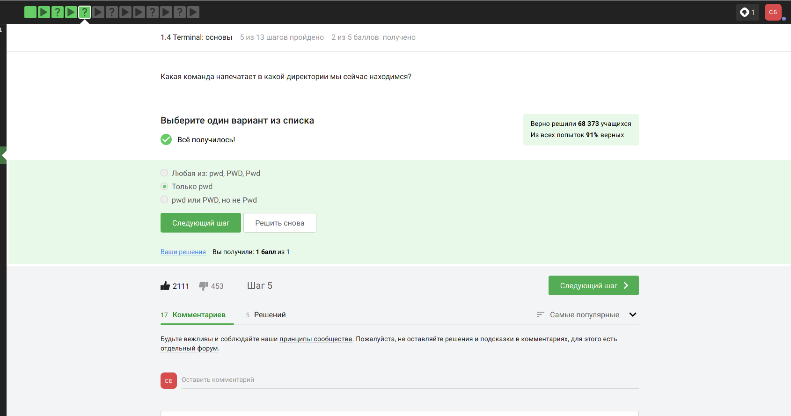
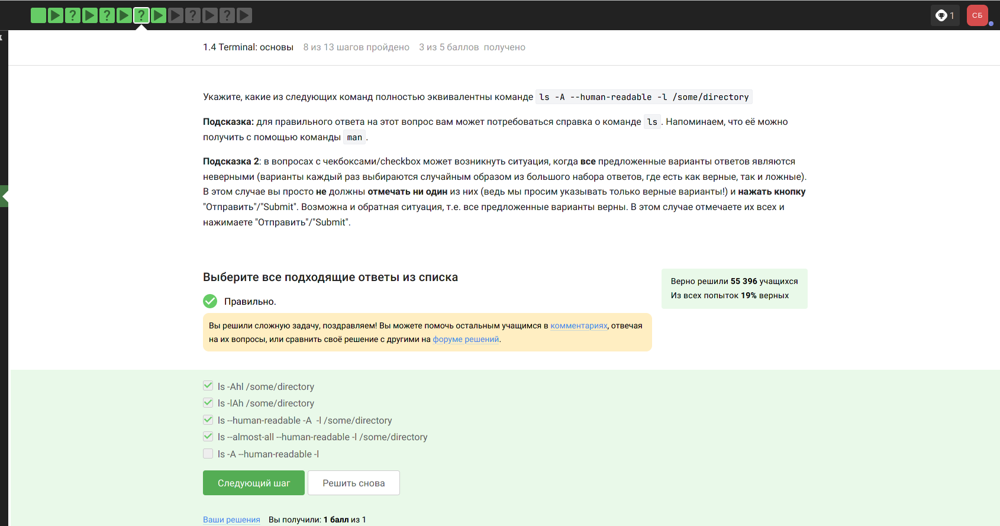
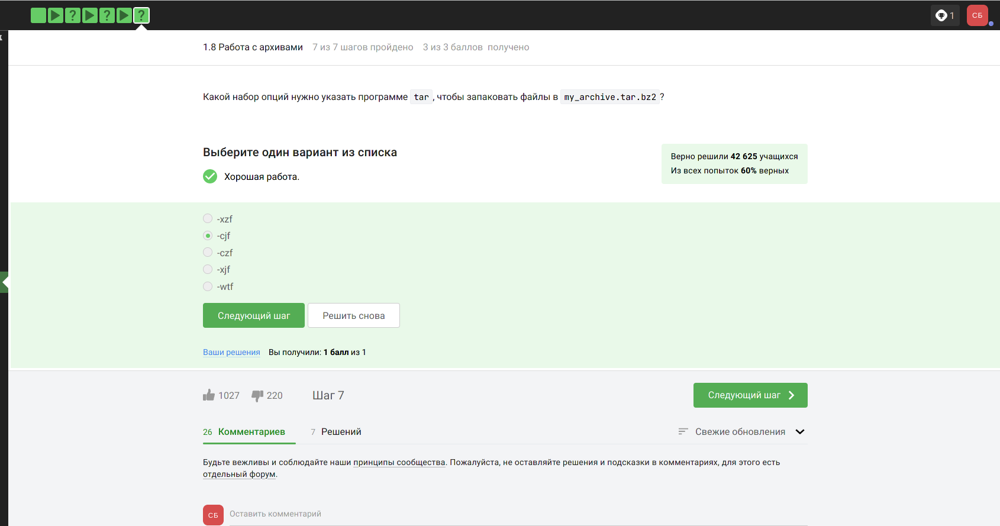
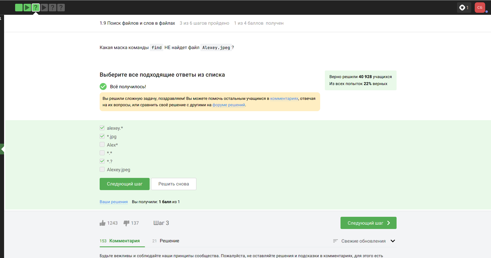

---
## Front matter
title: "Отчёт по внешнему курсу.Раздел 1"
subtitle: "Операционные системы"
author: "Бурыкина Софья Дмитриевна"

## Generic otions
lang: ru-RU
toc-title: "Содержание"

## Bibliography
bibliography: bib/cite.bib
csl: pandoc/csl/gost-r-7-0-5-2008-numeric.csl

## Pdf output format
toc: true # Table of contents
toc-depth: 2
lof: true # List of figures
lot: true # List of tables
fontsize: 12pt
linestretch: 1.5
papersize: a4
documentclass: scrreprt
## I18n polyglossia
polyglossia-lang:
  name: russian
  options:
	- spelling=modern
	- babelshorthands=true
polyglossia-otherlangs:
  name: english
## I18n babel
babel-lang: russian
babel-otherlangs: english
## Fonts
mainfont: PT Serif
romanfont: PT Serif
sansfont: PT Sans
monofont: PT Mono
mainfontoptions: Ligatures=TeX
romanfontoptions: Ligatures=TeX
sansfontoptions: Ligatures=TeX,Scale=MatchLowercase
monofontoptions: Scale=MatchLowercase,Scale=0.9
## Biblatex
biblatex: true
biblio-style: "gost-numeric"
biblatexoptions:
  - parentracker=true
  - backend=biber
  - hyperref=auto
  - language=auto
  - autolang=other*
  - citestyle=gost-numeric
## Pandoc-crossref LaTeX customization
figureTitle: "Рис."
tableTitle: "Таблица"
listingTitle: "Листинг"
lofTitle: "Список иллюстраций"
lotTitle: "Список таблиц"
lolTitle: "Листинги"
## Misc options
indent: true
header-includes:
  - \usepackage{indentfirst}
  - \usepackage{float} # keep figures where there are in the text
  - \floatplacement{figure}{H} # keep figures where there are in the text
---

Более подробно про Unix см. в [@tanenbaum_book_modern-os_ru; @robbins_book_bash_en; @zarrelli_book_mastering-bash_en; @newham_book_learning-bash_en].

# Выполнение внешнего курса 

Текст над фотографиями обьяснение всего первого разделла.

В первом разделе курса я узнаю, как устанавливать Linux. Важной частью курса являются задачи котрорые я выполняла  (рис. @fig:001).

{#fig:001 width=70%}

Также познакомились с основными предложениями из панели быстрого запуска Linux (рис. @fig:002).

{#fig:002 width=70%}

Для начала научилась просматривать, создавать и удалять файлы и папки через файловый менеджер. Познакомилась с простым и более продвинутым текстовыми редакторами (рис. @fig:003).

{#fig:003 width=70%} 

Посмотрела, как создавать документы с электронными таблицами и как выходить в интернет  (рис. @fig:004).

{#fig:004 width=70%} 

Еще рассмотрела различные способы установки новых программ на компьютер. Важно понимать, что Linux — это не какая-то одна операционная система, а целое семейство систем  (рис. @fig:005).

{#fig:005 width=70%} 

Все эти системы (их еще называют дистрибутивами) имеют много общего, но разрабатываются разными компаниями или сообществами энтузиастов, поэтому у них есть и различия (рис. @fig:006). (рис. @fig:029).

{#fig:006 width=70%} 

{#fig:029 width=70%} 

Нам показывали все примеры на дистрибутиве Ubuntu (рис. @fig:007).

{#fig:007 width=70%} 

Мы привыкли работать на компьютере, кликая с помощью мышки на иконки и выбирая пункты в различных меню. Однако есть и другой подход, который позволяет отдавать команды компьютеру, вводя их с помощью клавиатуры в специальную программу Terminal (рис. @fig:008).

{#fig:008 width=70%} 

Мы научились запускать Terminal, а также изучили несколько базовых команд для работы в нём. Мы научились запускать программы из командной строки (рис. @fig:009).

{#fig:009 width=70%} 

Сделала это как для уже установленных в системе приложений (например, Firefox), так и скачанных из интернета или написанных нами программ (рис. @fig:010).

{#fig:010 width=70%} 

Были рассмотрены возможности прервать или приостановить запущенную программу, а также запустить сразу несколько приложений одновременно (рис. @fig:011).

{#fig:011 width=70%} 

Большинство программ, запущенных в терминале, активно взаимодействует с пользователем: они требуют от него некоторые данные на вход, сообщая результаты своей работы на выходе (рис. @fig:012).

{#fig:012 width=70%} 

Чаще всего для ввода данных используется клавиатура, а результаты выводятся на экран (рис. @fig:013).

{#fig:013 width=70%} 

Однако это не всегда может быть удобно (рис. @fig:014).

{#fig:014 width=70%} 

Мы научились передавать приложению входные данные не с клавиатуры, а из файла, а также записывать (перенаправлять) результаты его выполнения и возникшие при этом ошибки не на экран, а в файл или несколько файлов (рис. @fig:015).

{#fig:015 width=70%} 

Скачивать файлы из интернета можно не только через браузер, но и через терминал. Мы научились это делать при помощи команды wget  (рис. @fig:016).

{#fig:016 width=70%} 

Эта программа очень многофункциональна, но мы рассмотрим только основные её возможности (рис. @fig:017).

{#fig:017 width=70%} 

Иногда нам нужно передать по почте или скачать из интернета очень большой файл (рис. @fig:019).

{#fig:019 width=70%} 

Или на нашем жестком диске заканчивается место и хочется, чтобы некоторые файлы занимали поменьше пространства. В этом случае нам на помощь могут прийти специальные программы — архиваторы (рис. @fig:020).

{#fig:020 width=70%} 

Они позволяют записывать хранящуюся в файлах информацию в более компактном виде, т. е. уменьшить их размер без потери информации (рис. @fig:021).

{#fig:021 width=70%} 

Обработанные архиватором данные (файлы и папки) помещаются в файл, который называется архив, а сам процесс обработки называется архивированием (сжатием, запаковыванием) (рис. @fig:022).

{#fig:022 width=70%} 

Размер архива зависит от того, какая информация была в исходных данных: например, тексты сжимаются очень хорошо, а видео-файлы почти не сжимаются (рис. @fig:023).

{#fig:023 width=70%} 

Терминал предоставляет мощные инструменты для поиска данных. Мы научились использовать их как для поиска файлов (по имени или даже части имени или расширения), так и для поиска слов в файле или сразу нескольких файлах. (рис. @fig:024).(рис. @fig:025).(рис. @fig:026).(рис. @fig:027).(рис. @fig:028).

{#fig:024 width=70%} 

{#fig:025 width=70%} 

{#fig:026 width=70%} 

{#fig:027 width=70%} 

{#fig:028 width=70%} 

# Список литературы{.unnumbered}

::: {#refs}
:::
